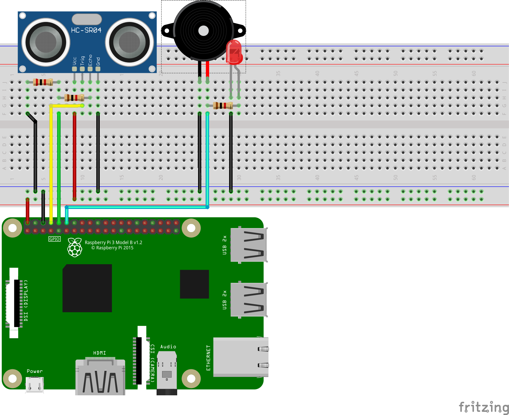

## Exemplo de alarme com GPIO

## Montagem



## Código

[Link código](python_code/script.py)

```python
#importa modulos necessarios
import RPi.GPIO as GPIO # da GPIO
import time             # do tempo
from datetime import datetime # da data
import signal           # de eventos assincronos
import sys              # da info sobre o interpretador
import logging          # para criar arquivos de log

# dir e nome onde o arquivo de log sera criado
nameLogFile = "/home/pi/uploadGDrive/log_movimentos.txt"

# usar os pinos numerados
GPIO.setmode(GPIO.BCM)

# define os pinos a serem usados
pinTrig = 14
pinEcho = 15
pinBuzz = 18

# seta os pinos de input e output
GPIO.setup(pinTrig, GPIO.OUT)
GPIO.setup(pinBuzz, GPIO.OUT)
GPIO.setup(pinEcho, GPIO.IN)

# function para criar logs
def createLog(dataHora):
    logging.basicConfig(level = logging.INFO, filename = nameLogFile)
    msg = dataHora.strftime("Movimento detectado %Hhrs:%Mmin:%Sseg_%d-%m-%Y")
    logging.warning(msg)
    print(msg)

try:

    while True:

        GPIO.output(pinTrig, True)
        time.sleep(0.75)
        GPIO.output(pinTrig, False)

        startTime = time.time()
        stopTime = time.time()

        while 0 == GPIO.input(pinEcho):
            startTime = time.time()

        while 1 == GPIO.input(pinEcho):
            stopTime = time.time()

        timeElapsed = stopTime - startTime # T2 - T1
        distance = (timeElapsed * 34300) / 2

        print ("Distancia: %.1f cm" % distance)

        if distance <= 30.00:
            dataHora = datetime.now()
            createLog(dataHora)
            GPIO.output(pinBuzz, True)
            time.sleep(1.00)
            GPIO.output(pinBuzz, False)

except KeyboardInterrupt:
    # limpa GPIO
    GPIO.cleanup()
```


